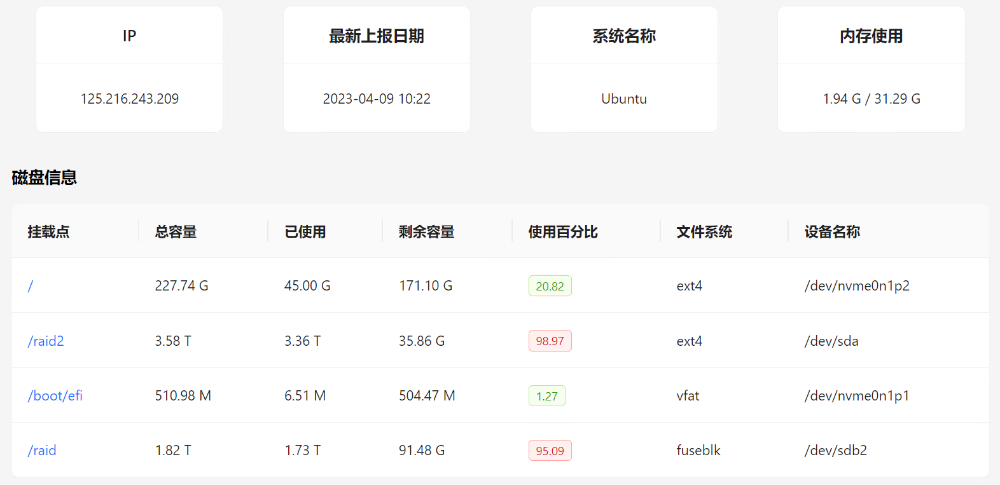
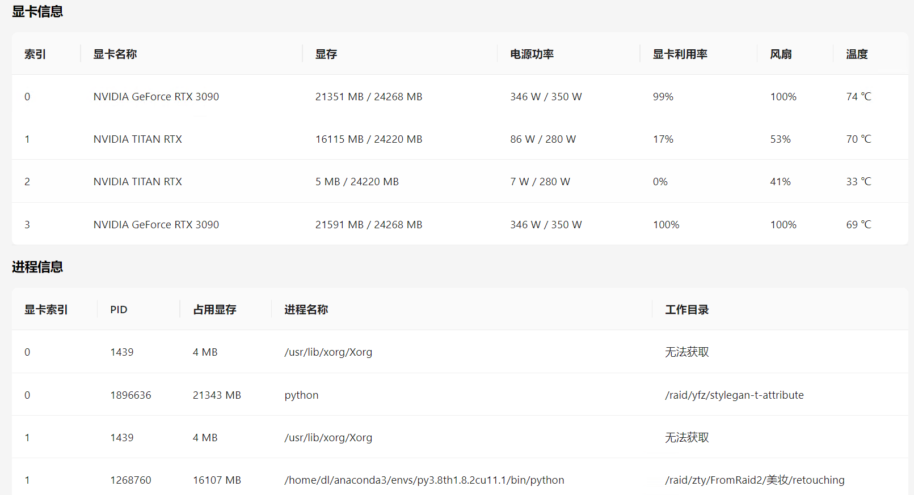
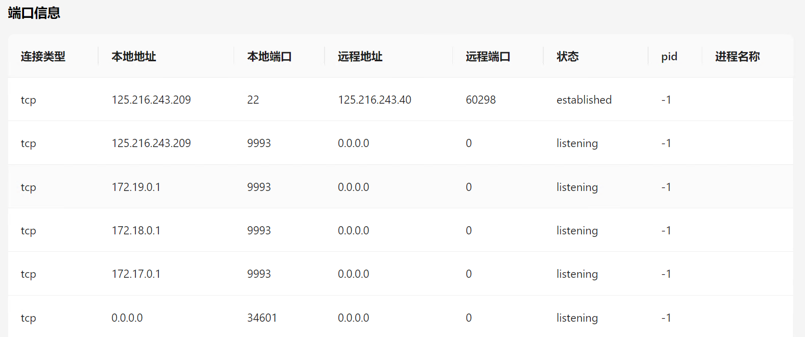

<p align="center">
  <a href="https://github.com/xz2048/server-monitor"></a>
</p>

<div align="center">

# 服务器监控系统

_✨ 基于 SpringBoot & React 的服务器监控系统 ✨_

</div>

<p align="center">
  <a href="https://raw.githubusercontent.com/xz2048/server-monitor/main/LICENSE">
    
  </a>
  <a href="https://github.com/xz2048/server-monitor/releases/latest">
    
  </a>
  <a href="https://github.com/xz2048/server-monitor/releases/latest">
    
  </a>
</p>

<p align="center">
  <a href="https://github.com/xz2048/server-monitor/releases">程序下载</a>
  ·
  <a href="https://github.com/xz2048/server-monitor#部署">部署教程</a>
  ·
  <a href="https://github.com/xz2048/server-monitor/issues">意见反馈</a>
  ·
  <a href="">在线演示</a>
</p>

## 代办
+ [ ] 一开始就发送心跳
+ [ ] 增加进程的开始时间
+ [ ] docker 容器的监控
+ [x] 内存信息
+ [x] GPU 信息
+ [x] GPU 进程信息
+ [x] 未使用的 GPU
+ [x] 硬盘信息
+ [x] 服务器是否断连
+ [x] 开放的端口信息
+ [x] 消息推送功能
+ [x] 硬盘不足报警
+ [ ] SSH 的版本
+ [ ] CPU 信息
+ [ ] 网络负载信息
+ [ ] 显卡空闲提醒
+ [ ] 远程终端
+ [ ] 内存，CPU历史记录
+ [ ] 更加详细的进程信息，如进程开始时间
+ [ ] 重要日志的信息，如登录日志
+ [ ] server 端提供下载上传数据脚本的功能
+ [ ] 清理数据 server 端数据库的功能
+ [ ] 远程文件管理

## 主要功能
1. 监控服务器的各项信息，和其他监控项目的不同是可以监控 GPU 的信息，适合实验室管理深度学习服务器的人员。
2. 消息推送，通过统一的 api 接口整合了企业微信、钉钉、飞书和邮件的推送功能。
3. 如果配置了上边的消息推送功能，如果发送服务器断连、硬盘不足、GPU 空闲等情况会发送邮件提醒（也可以通过企业微信、钉钉、飞书推送）。

## 展示




## 部署
### 基于 Docker 进行部署接收端
1. clone 该项目
```aidl
git clone https://github.com/ixuzhen/server-monitor.git
```
2. 根据自己需要修改配置文件 docker-compose.yaml 文件，不修改使用默认配置也可以跑起来（如果修改了 MySQL 或者 Redis 的信息，同时也需要修改 SpringBoot 的配置文件相应的配置）。
```
version: "3"

services:
  monitor_springboot:
#    image: monitor:0.0.1
    build:
      context: ./
      dockerfile: Dockerfile_SpringBoot
    container_name: monitor
    ports:
      - "8080:8080"
    networks:
      - monitor_net
    depends_on:
#      - redis
      - mysql_monitor
    command:
      - --spring.datasource.url=jdbc:mysql://mysql_monitor:3306/monitoring?serverTimezone=GMT%2B8&characterEncoding=utf-8&useSSL=false
      ## MySQL 用户名
      - --spring.datasource.username=root
      # MySQL 的密码，请保证与下方 MYSQL_ROOT_PASSWORD 的变量值一致。
      - --spring.datasource.password=123456
      
      # 发生消息的邮箱，验证码的邮箱
      - --spring.mail.username=xuzhe
      # 发生消息的邮箱，验证码的密码
      - --spring.mail.password=DfFjk


  mysql_monitor:
    image: mysql:8.0.31
    container_name: mysql_monitor
    ports:
      - "3307:3306"
    volumes:
      # 数据挂载
      - /root/mysql/data/:/var/lib/mysql/
      # 配置挂载
      - /root/mysql/conf/:/etc/mysql/conf.d/
      # 初始化目录挂载
      - /root/mysql/init/:/docker-entrypoint-initdb.d/

    networks:
      - monitor_net
    environment:
      # 请修改此密码，并对应修改上方 monitor_springboot 服务的 spring.datasource.password 变量值
      - MYSQL_ROOT_PASSWORD=123456
      - MYSQL_DATABASE=monitoring


  monitor_react:
    #    image: monitor:0.0.1
    build:
      context: ./
      dockerfile: Dockerfile_React
    container_name: react_monitor
    ports:
      - "80:80"
    networks:
      - monitor_net
    depends_on:
      - monitor_springboot

networks:
  monitor_net:
```
3. 运行命令
```
docker-compose up -d
```

### 部署发送端
1. clone 该项目
```aidl
git clone https://github.com/ixuzhen/server-monitor.git
cd ./server-monitor/client
```
2. 修改配置文件 config.yaml, 必须修改第一个，修改成自己的接收端服务器地址
```
# 中心服务器地址
server_address: http://225.216.243.111:8080
# 发送本机服务器信息的间隔时间，单位是秒
send_message_interval: 600
# 发送心跳包的间隔时间，单位是秒
send_hearbeat_interval: 60
```
3. 安装依赖并运行
```
# python 大于3.6
pip install pynvml;
pip install apscheduler;
pip install requests;

python main.py
```
## 配置
TODO
